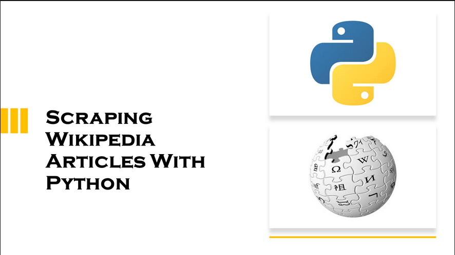

<h1 align="center"> Wikipedia scraper </h1>

    

## Table of Contents
- [Table of Contents](#table-of-contents)
- [Mission](#mission)
- [Usage](#usage)
- [Dependencies](#dependencies)
- [Timeline](#timeline)
- [Project structure](#project-structure)
- [Personal situation](#personal-situation)

## Mission

Create a scraper that builds a JSON file with the political leaders of each country you get from [this API](https://country-leaders.onrender.com/docs).

Include in this file the first paragraph of the Wikipedia page of these leaders (you'll retrieve the Wikipedia page URL from the API, which you then have to scrape yourself).

### Must-have features
- You should have a working `main.py` script that calls the API and creates a JSON file
- Create your own exception to include proper exception handling
- Have a nice README with crystal-clear installation and execution instructions

### Nice-to-have features
- Use [Session()](https://requests.readthedocs.io/en/latest/user/advanced/) from the `requests` library instead of `get()`
- A switch to store the output as CSV instead of JSON
- Speed up the execution using multiprocessing
 

## Usage
***
    Usage:
        Tu run the program in the terminal:
            python main.py 
 
    
## Dependencies
    python >= 3.10.0
    beautifulsoup4 >= 4.12.0

## Timeline
- **February 15, 2024:** 
  >>> Project kickoff 
  >>> Solution development 

- **February 16, 2024:**
  >>> Solution development 
  >>> Code documentation               
- **February 17, 2024:** 
  >>> Creation of [README.md](README.md) file

## Project structure

[wikipedia-scraper](.)
  * [output/](output)
    * [leaders_per_country.csv](output/leaders_per_country.csv)
    * [leaders_per_country.json](output/leaders_per_country.json)
  * [src/](src)
    * [img/](src/img)
    * [country_leader.py](src/country_leader.py)
    * [leader.py](src/leader.py)
    * [wikipedia_scraper.py](src/wikipedia_scraper.py)
  * [main.py](main.py)
  * [README.md](README.md)
  * [requirements.txt](requirements.txt)

## Personal situation
While doing this project I was part of the ARAI6 group of the <a href="https://becode.org/all-trainings/pedagogical-framework-ai-data-science/">AI Bootcamp</a> training organized by <a href="https://becode.org/">BeCode</a> in Ghent. The main objective of this project is to provide participants with an opportunity to understand the concepts of object-oriented programming (OOP) in Python. As well as getting information from an API, scraping a website that does not provide an API and saving the output for later use.

______________________________________
   <a href="https://www.linkedin.com/in/karel-rodriguez-duran/">Karel Rodríguez Durán</a>
